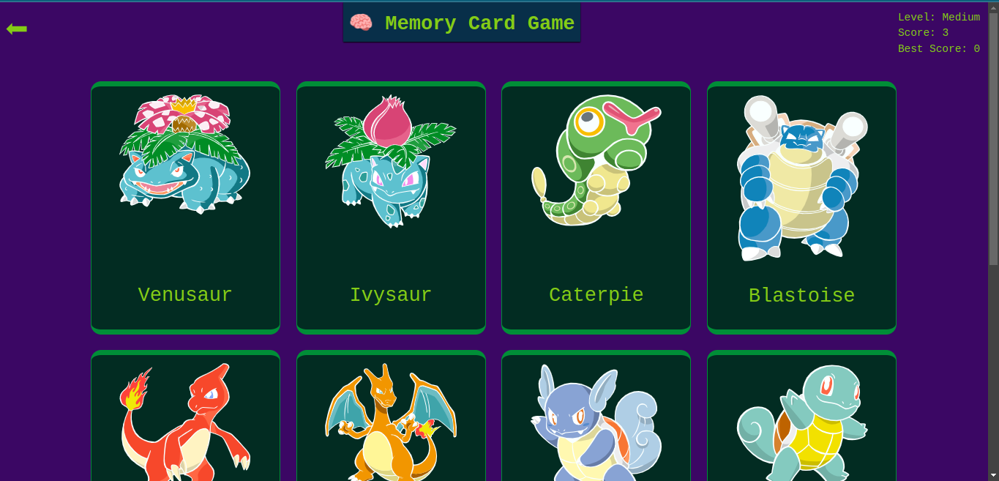

# Memory-card

A project based in curricular progress of [TOP](https://www.theodinproject.com/lessons/node-path-react-new-memory-card)

## Description

1. Memory card game to utilize the very role of react in games' features, and is built using Tailwind css framework along.
2. This project used vite as build tool
3. Memory card game is a memory testing game where you should have to memorize what you have selected so as not to select it again
4. Proficiency can be measured through scoring up to the number of cards available, as a best score
5. Cards will be shuffle when the app begins to pop, when yuser click on every card and when level switching.

## Table of contents

[Description](#description)
[Features](#features)
[Screenshots](#screenshot)
[Installation](#installation)
[API Documentation](#api-documentation)
[Contributing](#contributing)
[License](#license)
[Live Demo](#live-demo)

## Features
- This game isn't feature-rich as long as is built to utilize on-learning concepts in react.
- From the inception the app shows up with home page to maintain the game and check preferences for how to deal with the game.
- There are levels to maintain the level of difficulty
- Mid level interactivity with an alert for mishaps during playing.
- Different amount of Card in each level are determined.

## Screenshot

Here is the minimal and optimal overview for the app.




## Installation

To install the package, use the following steps
1. open your terminal in VS code( if you use so):
    `ctrl + backtick`

2. Then do

```bash
npm install
```

3. To Run the app in your dev server

```bash
npm run dev
```

## API Documentation
This project works by fetching images and their names from an api end point, [pokemonApi](https://pokeapi.co/)

## Contributing

1. Fork
2. Optimize per use suitability in your local machine
3. And code around limitlesslly

## License
This project is licensed under the [MIT License](https://github.com/Uwancha/memory-card/blob/main/LICENSE).Feel free to play around manipulating it.

## Live Demo

[Hit here](https://memriseit.netlify.app/) and got it
